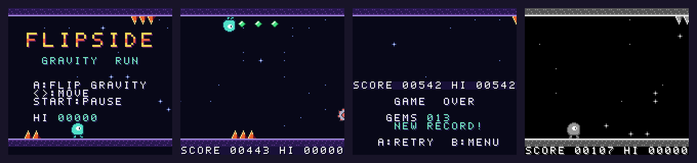

# FLIPSIDE — a Game Boy Color game



**Download the ROM: [`flipside.gbc`](flipside.gbc)** (32 KB). Load it in any
Game Boy Color emulator (SameBoy, Gambatte, mGBA, BGB, Emulicious, Delta on
iOS, RetroArch…) or flash it to a flash cart. It's a dual-mode cart, so it also
runs in greyscale on an original Game Boy / Game Boy Pocket, and on a Game Boy
Advance.

## The game

You are **Blip**, a little light-blob racing down an endless night corridor.
Blip can't jump. Blip can only **flip gravity** — press A and you fall up to
the ceiling, press it again and you fall back to the floor.

- **Spike strips** line the floor and the ceiling. Be on the other side.
- **Saws** sweep up and down the whole corridor. Time your pass, or hang back.
- **Gems** are worth 25 points. Some sit mid-air, so you grab them *during* a flip.
- The corridor gets faster the longer you last.
- Your best score is saved to the cartridge's battery-backed RAM.

| Button | Action |
|---|---|
| A (or B) | Flip gravity (only while standing — a press just before landing is remembered) |
| ◀ ▶ | Shuffle forward/back to line up or wait out a saw |
| Start | Pause |
| Select | Music on/off |

Scoring: 1 point per tile of distance, 25 per gem.

## How it's made

Written in C with [GBDK-2020](https://github.com/gbdk-2020/gbdk-2020) 4.3.

- `src/main.c` — the whole game: title screen, gravity physics, the level
  generator, saws/gems/particles, HUD and game-over panel on the window
  layer, sound effects and a two-channel chiptune loop, save RAM.
- `tools/gen_assets.py` — all graphics are ASCII art in this script (the font,
  the 2× title logo, Blip, the procedurally drawn saw blade). It writes
  `src/assets.c/.h`, plus the note-frequency table for the music.
- The level is generated one 8-pixel column at a time into the 32-column
  background map as it scrolls. The generator decides the *next* obstacle
  before sizing the gap in front of it, so whenever you have to switch from
  floor to ceiling there is always room for a full flip at the current speed.

### Build

```sh
# get GBDK-2020 from its releases page, then:
make GBDK_HOME=/path/to/gbdk
```

Cartridge header: CGB-compatible, MBC1 + RAM + battery, 32 KB ROM, 8 KB RAM.

### Tests

Both need `pip install pyboy pillow`.

- `python3 test/playtest.py flipside.gbc out/ [--dmg]` boots the ROM headless,
  plays a bit with a simple bot and saves screenshots of every screen.
- `python3 test/bot.py flipside.gbc 420` runs a search bot (it tries each move
  on an emulator save-state before committing) to check the level generator
  never produces an impossible stretch. It survives the full 7 minutes at top
  speed.
